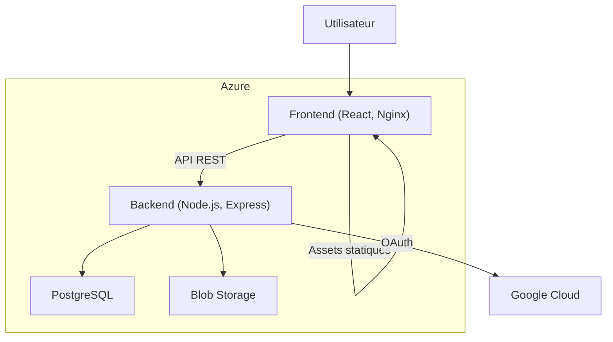
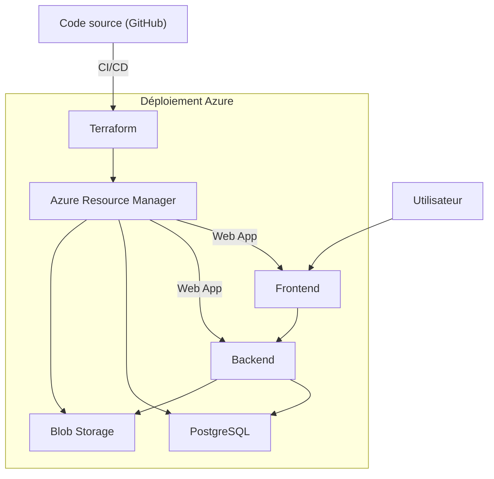

# Todo Docker - Déploiement Azure

Ce projet est une stack complète Todo (Node.js, React, PostgreSQL, Azure Blob) déployée sur Microsoft Azure avec Docker et Terraform.

## Sommaire
- [Architecture](#architecture)
- [Déploiement cloud sur Azure](#déploiement-cicd)
- [Structure des dossiers](#structure-des-dossiers)
- [Prérequis](#prérequis)
- [Déploiement](#déploiement)
- [Lancement local](#lancement-local)

---

## Architecture



---

## Déploiement cloud sur Azure



---

## Structure des dossiers

- `frontend/frontend/` : Application React + Nginx (conteneur Docker)
- `backend/` : API Node.js/Express (conteneur Docker)
- `infra/` : Infrastructure as Code (Terraform pour Azure)
- `docker-compose.yml` : Lancement local multi-conteneurs

---

## Prérequis
- [Docker](https://www.docker.com/)
- [Terraform](https://www.terraform.io/)
- Un compte Azure

---

## Déploiement

1. Initialiser l'infra :
   ```bash
   cd infra
   terraform init
   terraform apply
   ```
2. Récupérer les outputs Terraform (URL, secrets, etc.)
3. Configurer les variables d'environnement dans les apps (`.env`)
4. Déployer les images Docker sur Azure Web App

Pour plus de détails, voir `infra/README.md`.

---

## Lancement local

Pour tester la stack en local, tu peux utiliser `docker-compose` à la racine du projet :

```bash
# À la racine du projet
docker-compose up --build
```

Cela va lancer le backend, le frontend et la base de données PostgreSQL dans des conteneurs séparés.

- Les variables d'environnement locales peuvent être définies dans des fichiers `.env` dans les dossiers `backend/` et `frontend/frontend/`.
- Accède à l'application sur [http://localhost:3000](http://localhost:3000) (frontend) et [http://localhost:4000](http://localhost:4000) (backend).

Pour arrêter :
```bash
docker-compose down
```

---